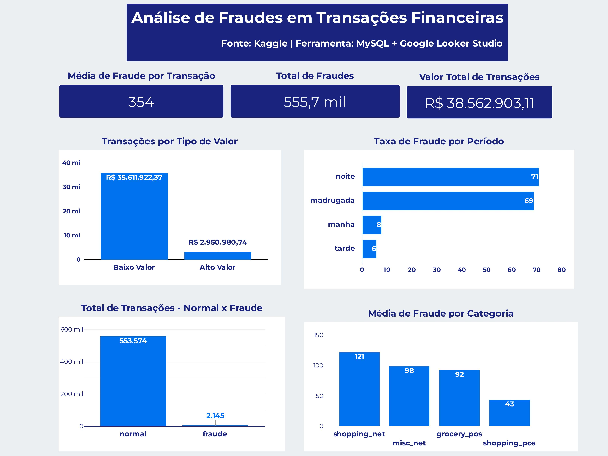
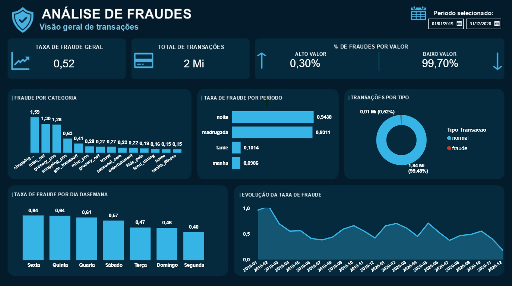
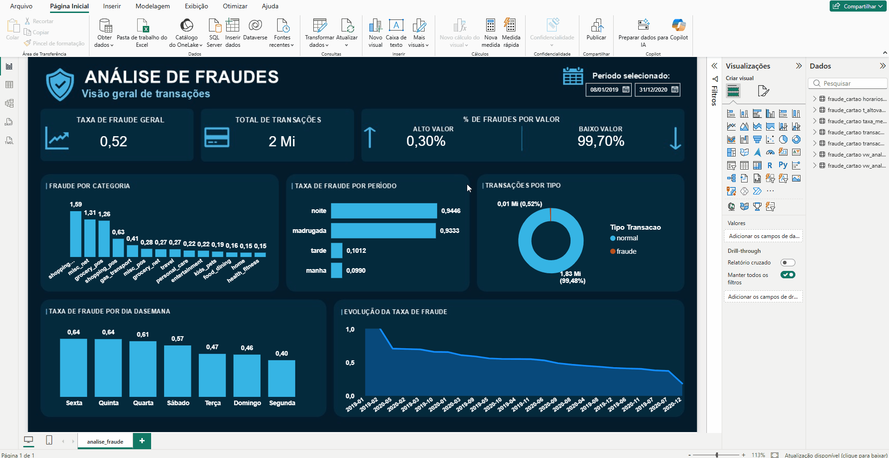

# 🔍 Detecção e Análise de Fraudes em Transações Financeiras

## Evoluindo uma análise de fraudes

Esse projeto começou como uma das minhas primeiras experiências usando SQL + Looker Studio para analisar fraudes em transações financeiras.

Depois de um tempo, voltei ao projeto e vi que dava para explorar muito mais. Tinha dois conjuntos de dados diferentes, então integrei os dois, revisei as consultas e views, e ampliei o período analisado. Isso já revelou padrões que antes estavam escondidos.

Conectei o Power BI direto ao SQL e comecei a trabalhar com DAX, o que tornou os indicadores mais dinâmicos e as visualizações interativas, mostrando fraude por categoria, por período, por dia da semana e evolução ao longo do tempo.

Alguns achados chamaram atenção:

- A taxa de fraude à noite e madrugada chegou a ser quase **9 vezes maior** que durante o dia — sinal de que esses horários merecem mais atenção.
- Categorias como **shopping online e serviços diversos** concentraram as maiores taxas de fraude entre as 14 analisadas.
- **Dezembro**, mesmo com o maior volume de transações, teve a **menor taxa de fraude** do período — possível reflexo de maior controle das empresas no fim de ano.

Comecei com SQL + Looker Studio e evoluí para SQL + Power BI + DAX. Cada etapa trouxe novos aprendizados — e o repositório está organizado por fase, para deixar essa evolução visível.

---

## 🔄 Evolução do Projeto

| | Fase 1 | Fase 2 |
|---|---|---|
| Dataset | `fraudTest.csv` | `train.csv` + `test.csv` |
| Total de transações | 555.719 | 1.852.394 |
| Período analisado | Jun–Dez/2020 | Jan/2019–Dez/2020 |
| Ferramenta de visualização | Looker Studio | Power BI + DAX |
| Modelagem preditiva | ✅ (Regressão Logística + Random Forest) | ⏳ ainda não reexecutada |
| Análise por dia da semana | ❌ | ✅ |
| Análise temporal | ❌ | ✅ |

---

## 📂 Estrutura do repositório

```
fraude-transacoes-financeiras/
├── fase_1_looker_studio/
│   ├── sql/
│   │   ├── 01_create_table.sql          # criação da tabela
│   │   ├── 02_import_data.sql           # importação dos dados brutos
│   │   ├── 03_data_quality.sql          # validação de qualidade dos dados
│   │   ├── 04_analysis.sql              # consultas de análise exploratória
│   │   └── 05_views.sql                 # views usadas no dashboard
│   ├── notebooks/
│   │   └── 02_modelagem_fraude.py       # modelagem preditiva (Regressão Logística + Random Forest)
│   ├── reports/
│   │   ├── figures/
│   │   │   ├── 01_curva_roc.png
│   │   │   ├── 02_curva_precision_recall.png
│   │   │   ├── 03_matriz_confusao.png
│   │   │   └── 04_importancia_variaveis.png
│   │   ├── metricas_modelos.csv         # métricas consolidadas dos dois modelos
│   │   └── predicoes_amostra.csv
│   └── dashboard/
│       ├── dashboard_fase_1.jpg         # print do dashboard
│       └── fraude-transacoes-financeiras.pdf  # pdf do dashboard Looker Studio
│
├── fase_2_power_bi/
│   ├── sql/
│   │   └── evolucao_query_fraude_transacao.sql  # análise expandida: dataset completo + dia da semana + temporal
│   ├── data/
│   │   └── processed/
│   │       ├── fraude_por_horario.csv
│   │       ├── taxa_media_fraude.csv
│   │       ├── transacoes_normal_vs_fraude.csv
│   │       ├── transacoes_por_valor.csv
│   │       ├── transacoes_analise_dia_semana.csv    # novo
│   │       └── transacoes_analise_temporal.csv       # novo
│   └── dashboard/
│       ├── dashboard_fase_2.png                    # print do dashboard Power BI
│       └── evolucao_dashboard_analise_fraude.gif   # demo interativa
│
├── docs/
│   ├── 01_dissertacao_problema.md       # contexto do problema e por que ele importa
│   ├── 02_fontes_de_dados.md            # documentação completa da fonte de dados
│   └── 03_relatorio_insights.md         # EDA + resultados da modelagem, consolidados
│
├── .gitattributes
├── .gitignore
└── README.md
```

---

## 🎯 O problema

Fraude em cartão de crédito é rara em volume, mas cara em impacto, e é um problema clássico de classe desbalanceada, onde acurácia simples é enganosa. O contexto completo do problema, sua relevância para o setor financeiro e a motivação do projeto estão em [`docs/01_dissertacao_problema.md`](docs/01_dissertacao_problema.md).

## 📊 Fonte de dados

**Credit Card Transactions Fraud Detection Dataset**, por Kartik Shenoy ([Kaggle](https://www.kaggle.com/datasets/kartik2112/fraud-detection)), gerado com a ferramenta **Sparkov Data Generation** — dados sintéticos, sem informação real de clientes.

- **Fase 1:** `fraudTest.csv` — 555.719 transações, 2.145 fraudes (0,386%)
- **Fase 2:** `train.csv` + `test.csv` — 1.852.394 transações (jan/2019 – dez/2020)

Documentação completa da fonte em [`docs/02_fontes_de_dados.md`](docs/02_fontes_de_dados.md).

> ⚠️ Os arquivos CSV brutos e o `.pbix` não estão versionados neste repositório por conta do tamanho (>100MB). O dataset pode ser baixado direto pelo Kaggle no link acima.

---

## 📊 Dashboard

**Fase 1 — Looker Studio**
[🔗 Acessar dashboard](https://datastudio.google.com/reporting/71a786d5-9c84-4154-9db4-0d58a8c8f274)



**Fase 2 — Power BI + DAX**





---

## 🔑 Principais Resultados (Fase 2)

| Indicador | Resultado |
|---|---|
| Total de transações | 1.852.394 |
| Taxa de fraude geral | 0,52% |
| Período com mais fraude | Noite (0,94%) e Madrugada (0,93%) |
| Categorias mais fraudulentas | shopping_net (1,59%), misc_net (1,30%), grocery_pos (1,26%) |
| Dia da semana com mais fraude | Sexta-feira e Quinta-feira (0,64%) |
| Mês com menor taxa de fraude | Dezembro |
| Fraudes por faixa de valor | 99,70% em transações de baixo valor |

---

## 🤖 Modelagem Preditiva (Fase 1)

> ⚠️ Modelagem realizada sobre o dataset da **Fase 1** (`fraudTest.csv`, 555.719 transações). Ainda não foi reexecutada sobre o dataset expandido da Fase 2 (1.852.394 transações).

| Modelo | AUC-ROC | AUC-PR | Recall (fraude) | Precisão (fraude) |
|---|---|---|---|---|
| Regressão Logística | 0,942 | 0,147 | 80,6% | 2,3% |
| **Random Forest** | **0,990** | **0,816** | **87,9%** | **36,0%** |

O Random Forest é o modelo recomendado: recall similar à Regressão Logística, mas com precisão muito superior e menos falsos positivos. `amt` (valor) e `hora` são as variáveis mais relevantes, confirmando o padrão noturno da EDA.

Gráficos de avaliação em [`fase_1_looker_studio/reports/figures/`](fase_1_looker_studio/reports/figures/). Script completo em [`fase_1_looker_studio/notebooks/02_modelagem_fraude.py`](fase_1_looker_studio/notebooks/02_modelagem_fraude.py). Análise completa em [`docs/03_relatorio_insights.md`](docs/03_relatorio_insights.md).

---

## 🚨 Possíveis ações de negócio

- Monitoramento reforçado em horários críticos (22h–6h), especialmente sextas e quintas
- Alertas automáticos para categorias digitais de maior incidência (`shopping_net`, `misc_net`)
- Modelo de scoring (Random Forest) como camada adicional de triagem antes da revisão manual
- Threshold de decisão ajustável conforme o apetite ao risco do time de fraude

---

## 🛠️ Stack

- **SQL (MySQL)** — modelagem, views e análise exploratória
- **Python** — modelagem preditiva (Regressão Logística + Random Forest)
- **Power BI + DAX** — dashboard interativo (Fase 2)
- **Looker Studio** — dashboard (Fase 1)

---

## 🧠 Aprendizados

- Análise exploratória de dados e modelagem preditiva em conjunto, não isoladas
- Avaliação de modelos sob classe desbalanceada (AUC-PR, matriz de confusão — não acurácia)
- Manipulação e consulta com SQL em dataset de 1,85 milhão de linhas
- Construção de dashboards em Power BI com DAX e Looker Studio
- Revisão e evolução de projetos anteriores, não só criação do zero
- Documentação de projeto de ponta a ponta, do problema de negócio à recomendação

---

## 👩‍💻 Autora

**Priscilla J. Paz**
- [LinkedIn](https://www.linkedin.com/in/priscilla-j-paz)
- [GitHub](https://github.com/priscilladejesuspaz)
- [Portfólio](https://portfolio-priscilla-umber.vercel.app)
